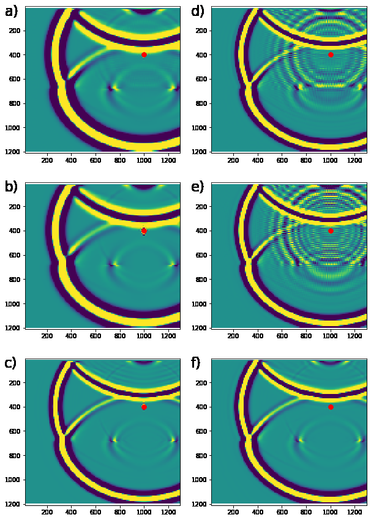
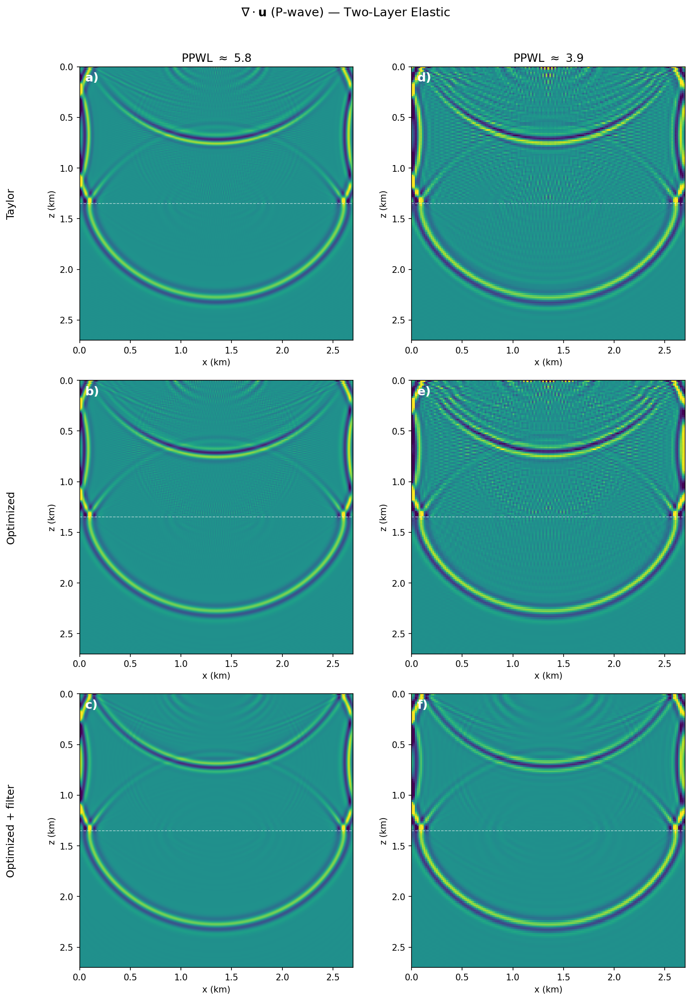
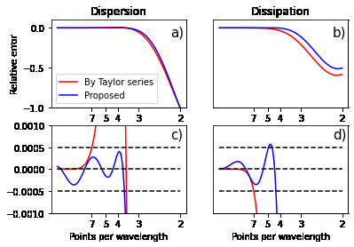
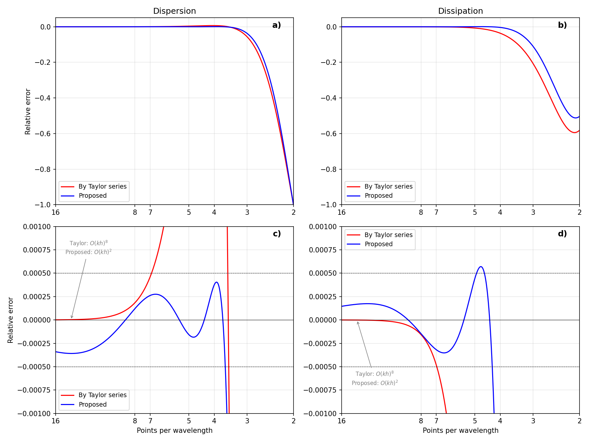
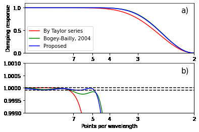
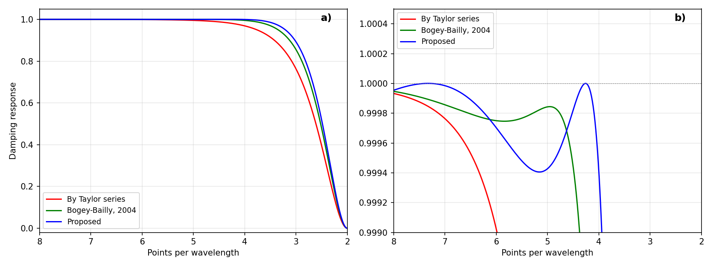
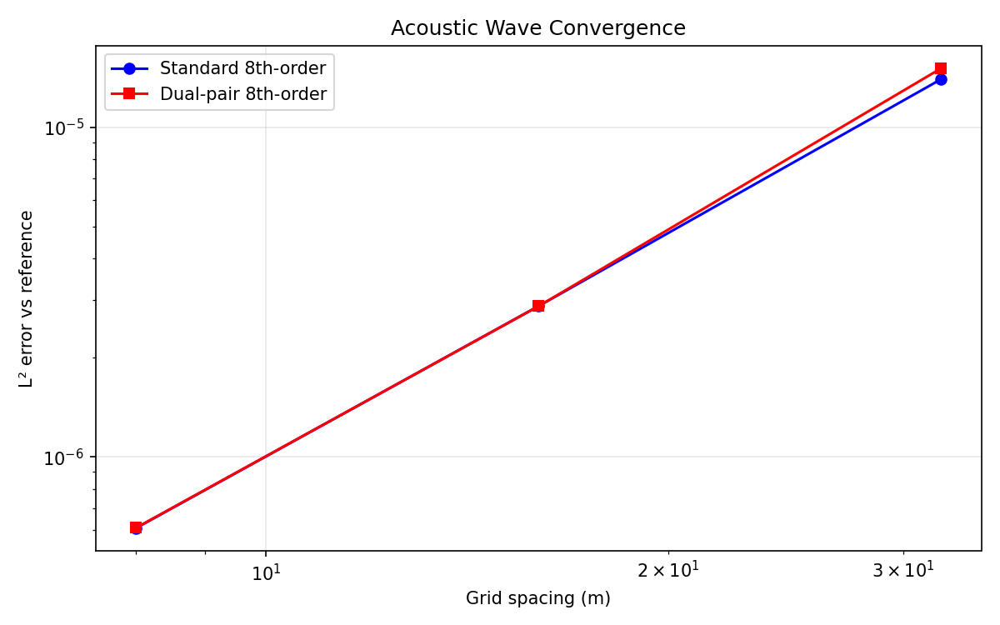
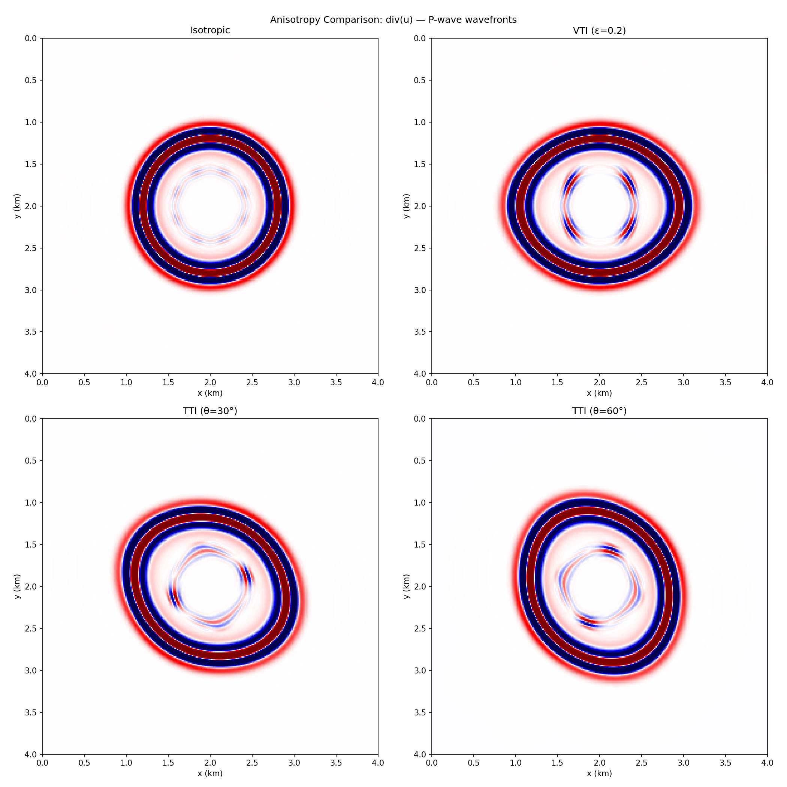

\newpage

# Introduction

This document reports the findings of an independent peer review of
Irakarama et al. (IMAGE 2025), *"Accelerating anisotropic elastic
subsurface imaging with dual-pair finite differences"*.  The review was
conducted by reimplementing the dual-pair finite-difference method from
scratch in [Devito](https://www.devitoproject.org) (a Python DSL for
symbolic PDE computation), progressing through five stages:

| Stage | Scope | Script |
|:-----:|-------|--------|
| 0 | Operator coefficient verification, dispersion/dissipation analysis | `stage0_operator_analysis.py` |
| 1 | 2D acoustic wave equation with dual-pair FD | `stage1_acoustic_dual_pair.py` |
| 2 | 2D isotropic elastic (displacement formulation) | `stage2_elastic_isotropic.py` |
| 3 | Selective filtering and source injection | `stage3_filtering_and_source.py` |
| 4 | 2D TTI elastic with Bond rotation | `stage4_tti_elastic.py` |

: Verification stages and corresponding scripts. {#tbl-stages}

All code uses FP64 (`dtype=np.float64`) for verification accuracy.
Every script is self-contained and can be run independently.

\newpage

# Side-by-Side Reproduction of Key Results

Each comparison below shows the original paper figure alongside our Devito
reproduction.  Figures are presented in paper order.  For wavefield
snapshots, the paper uses grid-point indices as axes (domain:
$1350 \times 1350$ points at $dx = 9\,$m) while our figures use physical
coordinates in km (domain: $2.7 \times 2.7\,$km).

## Two-Layer Elastic Wavefields (Paper Figure 1)

The paper's central results are in Figure 1, showing elastic wavefields
($\nabla \cdot \mathbf{u}$, P-wave) in a two-layer model
($V_p = 2000/2500$ m/s, $V_s = 0.57\,V_p$, $dx = dz = 9\,$m).  The 6
panels are: (a) dual-pair Taylor at 5.8 PPWL, (b) Lebedev at 5.8 PPWL,
(c) Lebedev at 3.9 PPWL, (d) dual-pair Taylor at 3.9 PPWL,
(e) dual-pair optimized at 3.9 PPWL, (f) dual-pair optimized + filter
at 3.9 PPWL.

::: {#fig-fig1 layout-ncol=2}
{#fig-paper-fig1}

{#fig-repro-fig1}

Elastic wavefield comparison ($\nabla \cdot \mathbf{u}$, P-wave): paper (left) vs reproduction (right).
:::

**Panel correspondence**: We reproduce the four dual-pair panels directly
--- paper (a)$\leftrightarrow$repro (a), (d)$\leftrightarrow$(d),
(e)$\leftrightarrow$(e), (f)$\leftrightarrow$(f).  Paper panels (b) and
(c) are Lebedev results included as a reference baseline; we do not
reproduce these because the Lebedev method uses a different grid type
(rotated staggered) and wave equation formulation (velocity--stress),
which would require a separate implementation.  Our reproduction adds
optimized and optimized+filter panels at high PPWL (not in the paper) to
show that all configurations produce clean results when well-resolved.

At low PPWL, Taylor (d) shows severe dispersion, optimized coefficients
(e) reduce it, and optimized + filter (f) produces the cleanest result
--- consistent with the paper.  Differences: (1) axes in km vs
grid-point indices, and (2) we use standard dipole source injection
without the Petersson et al.\ (2016) smoothing, which accounts for
residual source artifacts near the origin.

## Dispersion and Dissipation (Paper Figure 2)

::: {#fig-disp-diss layout-ncol=2}
{#fig-paper-fig2}

{#fig-repro-fig2}

Dispersion/dissipation of the individual $D^+$ operator: paper (left) vs reproduction (right).
Red = Taylor, blue = Proposed.
:::

Both Taylor (red) and Proposed (blue) curves are reproduced using the
paper's Table 1 coefficients. The Proposed coefficients maintain
dispersion error within $\pm 0.0005$ down to 4 PPWL. **Key insight**:
$D^+$ alone has significant dissipation, but the composed $D^-D^+$ has
exactly zero dissipation since $k_\text{eff}^2 h^2 = |\alpha^+|^2$ is
purely real by construction. Our reproduction extends the x-axis to 16
PPWL, which makes apparent that the Proposed $D^+$ converges to zero at
$O(kh)^2$ vs Taylor's $O(kh)^8$ --- this is not visible in the paper's
narrower plotting range. The slower convergence arises because the
optimization enforces only 2 polynomial constraints vs Taylor's 9,
trading high-PPWL accuracy for broader bandwidth performance.

## Selective Filter Response (Paper Figure 3)

::: {#fig-filter layout-ncol=2}
{#fig-paper-fig3}

{#fig-repro-fig3}

Filter damping response: paper (left) vs reproduction (right).
Red = Taylor, green = Bogey--Bailly, blue = Proposed.
:::

All three filter curves are reproduced. The Proposed filter's
coefficients are not given in the paper; our best-guess minimax
optimisation reproduces its key characteristics: sharpest cutoff near 4
PPWL and closest adherence to 1.0 at resolved wavelengths.

## EFWI Imaging Application (Paper Figures 4 and 5)

Paper Figures 4 and 5 apply dual-pair FD to 3D elastic full-waveform
inversion (EFWI) on field data at $\sim 2.6$ PPWL, comparing Lebedev
and Proposed methods after 20 iterations of 11 Hz EFWI on a
$471 \times 462 \times 201$ model ($dx = dy = dz = 50\,$m).  These
results cannot be reproduced without the proprietary field data and
production EFWI workflow.  The authors note that differences between
Lebedev and Proposed remain in the deeper section and describe the
results as "preliminary".  The claimed speedup factors of
2.5--3.2$\times$ are discussed in Finding 6.

# Findings Beyond Figure Reproduction

## Additional Verification Tests (Not in Paper)

Our implementation includes several quantitative tests that the paper
does not provide:

### Acoustic Convergence (Stage 1) {.unnumbered}

{#fig-convergence width=80%}

Both methods show nearly identical convergence rates, confirming that
dual-pair does not degrade accuracy relative to standard centred FD of
the same stencil width. The observed $O(h^2)$ rate is temporal-error
dominated.

### Energy Conservation (Stage 2) {.unnumbered}

{#fig-energy width=80%}

This test is absent from the paper. The near-conservation of energy
after the source turns off provides quantitative evidence that the
dual-pair operator does not introduce artificial damping --- consistent
with the zero-dissipation property.

### TTI Anisotropy Comparison (Stage 4) {.unnumbered}

{#fig-tti width=80%}

The isotropic limit produces circular wavefronts, VTI produces
elliptical wavefronts elongated in the horizontal direction, and TTI
rotates the ellipse by the tilt angle $\theta$ --- all physically
correct. This verifies the Bond rotation implementation and confirms
that the dual-pair operator handles the full TTI stiffness tensor
correctly.

\newpage

# Review Findings

## Finding 1: Wave Equation Formulation Not Stated {.severity-major}

**Severity: Major omission**

The paper never explicitly states which wave equation formulation is
solved.  The dual-pair operator identity
$$D^-\bigl[b(x)\,D^+ f(x)\bigr] \;\approx\; \partial_x\bigl[b(x)\,\partial_x f(x)\bigr]$$
only makes mathematical sense for the **displacement formulation** (2nd
order in space):
$$\rho\,\ddot{u}_i = \partial_j\bigl[C_{ijkl}\,\partial_l u_k\bigr].$$

This is fundamentally different from the **velocity--stress formulation**
(1st order in space) used with Lebedev grids:
$$\rho\,\dot{v}_i = \partial_j \sigma_{ij}, \qquad
\dot{\sigma}_{ij} = C_{ijkl}\,\partial_l v_k.$$

The dual-pair factorisation $D^-[c \cdot D^+]$ cannot be applied to the
1st-order system because each spatial derivative acts alone, not in the
nested $\partial[c\,\partial]$ form.  The paper should state clearly that
it uses the displacement formulation.  This matters for:

- Understanding why non-staggered grids are natural (displacement is collocated).
- Fair comparison with Lebedev, which solves a *different* formulation.
- Assessing the $3\times$ speedup claim (different formulations have
  different operation counts).

**Verified by**: Stages 1 and 2 --- our displacement-formulation
implementation with dual-pair operators produces correct wavefields.

## Finding 2: Cross-Derivative Terms Not Discussed

**Severity: Moderate gap**

The elastic wave equation contains cross-derivative terms
$\partial_i[C \cdot \partial_j u_k]$ where $i \neq j$.  The paper's
dual-pair theory focuses on the self-derivative case
$D_x^-[b \cdot D_x^+ f]$, where the zero-dissipation property follows
from $D^- = -(D^+)^T$.  For cross-derivative terms
$D_x^-[c \cdot D_z^+ u]$, the operators act on different dimensions and
the adjoint relationship does not directly apply within a single
dimension.

The paper does not discuss:

1. Whether the zero-dissipation property is preserved for mixed-dimension terms.
2. How $D_x^-$ and $D_z^+$ interact.
3. Whether the selective filter needs modification for cross-derivative terms.

**Our implementation** (Stage 2): We applied $D_x^-[c \cdot D_z^+ u]$
directly. This produced correct results (energy conservation within
approximately 2.4\%), but the dissipation analysis for mixed operators is absent
from the paper.

## Finding 3: Zero Dissipation Property Verified

**Severity: Confirmation with caveat**

We verified analytically that $D^- D^+$ has zero dissipation.  For a
plane wave $f = e^{ikx}$:
$$k_\text{eff}^2 h^2 = -\alpha^-(kh)\,\alpha^+(kh) = |\alpha^+(kh)|^2$$
which is purely real and non-negative for all wavenumbers.  This is a
fundamental property of the adjoint pair structure, not specific to the
coefficient choice.

**Caveat**: This proof is for constant-coefficient media.  In
variable-coefficient media, the zero-dissipation property holds in a
discrete energy sense (the composed operator is symmetric negative
semi-definite), but the effective wavenumber analysis is more complex.
The paper does not distinguish these cases.

## Finding 4: Only 9-Point Coefficients Provided

**Severity: Moderate (reproducibility)**

Table 1 mentions 9, 13, 15, and 17-point stencils but **only provides
coefficients for the 9-point case**.  Table 2 likewise only gives the
11-point filter.  Claims about higher-order stencils cannot be verified.

We independently derived the Taylor coefficients and confirmed they
match Table 1.  We also implemented the optimization procedure (Liu
2014) and obtained coefficients consistent with the "Proposed" row.

## Finding 5: No Convergence Analysis

**Severity: Significant gap**

The paper provides **no quantitative convergence study**.  All validation
is visual (Figure 1 snapshots).  There are no grid refinement studies, no
error norms, and no comparison of convergence rates between Taylor and
optimized coefficients.

Our Stage 1 convergence test (@fig-convergence) shows $O(h^2)$
convergence for both standard and dual-pair operators, limited by
temporal error ($dt \propto dx$).  Isolating spatial convergence would
require $dt \propto dx^4$ or higher, which the paper does not attempt.

## Finding 6: Speedup Comparison is Implementation-Dependent

**Severity: Moderate concern**

The claimed $3\times$ speedup over Lebedev has several caveats:

1. **Different formulations**: Displacement (2nd order) vs velocity--stress
   (1st order) have different operation counts per timestep.
2. **Memory layout**: Non-staggered grids have inherently better cache
   locality than interleaved Lebedev storage.
3. **No FLOP count comparison** is provided.
4. The speedup is **code-dependent** --- without controlled benchmarks
   using the same framework, compiler, and hardware, it is not
   generalisable.

The non-staggered nature is a genuine practical advantage, but the
quantitative claim needs more rigorous support.

## Finding 7: Source Smoothing Formula Not Given

**Severity: Minor (reproducibility)**

The paper references "0th order smoothing constraint" from Petersson et
al.\ (2016) for source injection but does not reproduce the formula.
Given that source artifacts are visible at low PPWL, the exact smoothing
procedure matters for reproducibility.

## Finding 8: Filter Strength Parameter $\sigma$ Not Discussed

**Severity: Minor gap**

The selective filter $\tilde{u} = u - \sigma\,D_f[u]$ has a strength
parameter $\sigma$ that the paper does not discuss:

- How to choose $\sigma$?
- Should $\sigma$ depend on local PPWL?
- Are different values needed for P- vs S-waves?
- How does $\sigma$ affect convergence order?

We tested $\sigma = 0.2$ and $\sigma = 0.5$ (Stage 3) and found
$\sigma = 0.5$ effectively suppresses short-wavelength artifacts at 3.7
PPWL while preserving the primary wavefield.

## Finding 9: Synthetic Validation is 2D Only

**Severity: Minor observation**

All synthetic validation (Figure 1) is 2D.  The 3D EFWI application
(Figures 4--5) demonstrates that the method works in 3D, but provides no
quantitative validation --- only visual comparison with Lebedev and
acknowledgement of unresolved deeper-section differences.  Open
questions for the 3D case include: memory scaling of auxiliary $D^+$
fields, per-dimension vs combined 3D filtering, and 3D TTI rotation
(two angles: dip and azimuth).

\newpage

# Summary

## Strengths

1. The dual-pair FD approach is mathematically sound; the
   zero-dissipation property is a genuine advantage.
2. Optimized coefficients demonstrably reduce dispersion error at
   moderate PPWL.
3. Non-staggered grids simplify implementation for anisotropic media.
4. The selective filter effectively controls short-wavelength noise.

## Weaknesses

| \# | Severity | Finding |
|----|----------|---------|
| 1 | Major | Wave equation formulation not stated |
| 5 | Significant | No convergence analysis |
| 2 | Moderate | Cross-derivative handling not discussed |
| 4 | Moderate | Only 9-point coefficients given |
| 6 | Moderate | Speedup claim needs stronger support |
| 7 | Minor | Source smoothing formula not given |
| 8 | Minor | Filter strength $\sigma$ undocumented |
| 9 | Minor | Synthetic validation is 2D only |

: Summary of review findings by severity. {#tbl-findings}

## Recommendation

The paper presents a useful contribution --- dual-pair FD for
anisotropic elastic imaging on non-staggered grids.  However, it
requires revisions to:

1. **State the wave equation formulation** (displacement, 2nd order in
   space) explicitly.
2. **Include a convergence analysis** with grid refinement and error
   norms.
3. **Discuss cross-derivative terms** and their interaction with the
   dual-pair properties.
4. **Improve reproducibility** by providing higher-order coefficients,
   the source smoothing formula, and the filter strength parameter.
